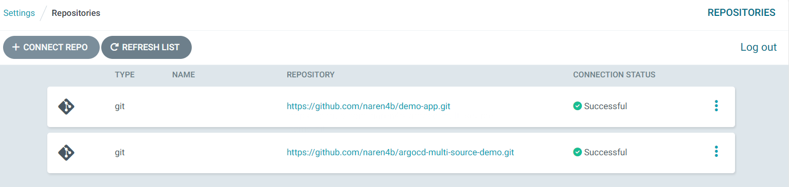
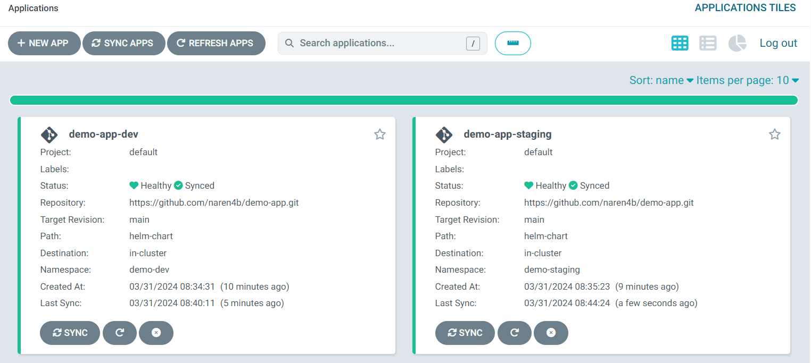

# Multiple Sources for an ArgoCD Application

ref: Argo CD has the ability to specify multiple sources for a single Application. Argo CD compiles all the sources and reconciles the combined resources. 
(argocd-multi-sources)[https://argo-cd.readthedocs.io/en/stable/user-guide/multiple_sources/]

# Add Git repo

```bash
#Install ArgoCD
kubectl create namespace argocd
kubectl apply -n argocd -f https://raw.githubusercontent.com/argoproj/argo-cd/stable/manifests/install.yaml
# edit and add the argocd-server args - --insecure
kubectl get secrets -n argocd argocd-initial-admin-secret -o jsonpath="{.data.password}" | base64 -d && echo 

# Install argocd CLI
curl -sSL -o argocd-linux-amd64 https://github.com/argoproj/argo-cd/releases/latest/download/argocd-linux-amd64
sudo install -m 555 argocd-linux-amd64 /usr/local/bin/argocd
rm argocd-linux-amd64

# ArgoCD CLI login 
argocd login localhost:8080  --insecure

USERNAME=npanda
TOKEN=hello

# Add Template Repo
REPO_URL=https://github.com/naren4b/demo-app.git
argocd repo add ${REPO_URL} --username ${USERNAME} --password ${TOKEN}

# ADD Value Repo

REPO_URL=https://github.com/naren4b/argocd-multi-source-demo.git
argocd repo add ${REPO_URL} --username ${USERNAME} --password ${TOKEN}
```


# Deploy the App 
```bash
git clone https://github.com/naren4b/argocd-multi-source-demo.git
kubectl  apply -f dev-demo-argo-application.yaml -f staging-demo-argo-application.yaml
```

# Check the manifest file & match with the values given 
kubectl get cm -n demo-dev demo -o jsonpath="{.data.env}" && echo 
kubectl get cm -n demo-staging demo -o jsonpath="{.data.env}" && echo 

